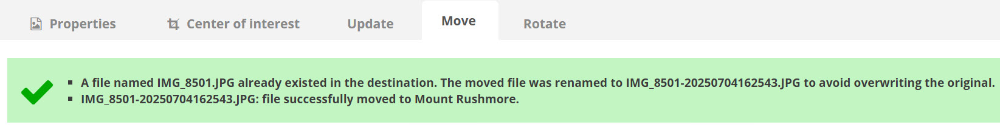
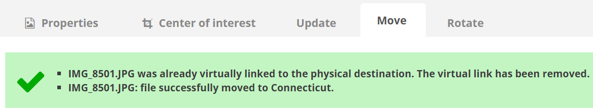
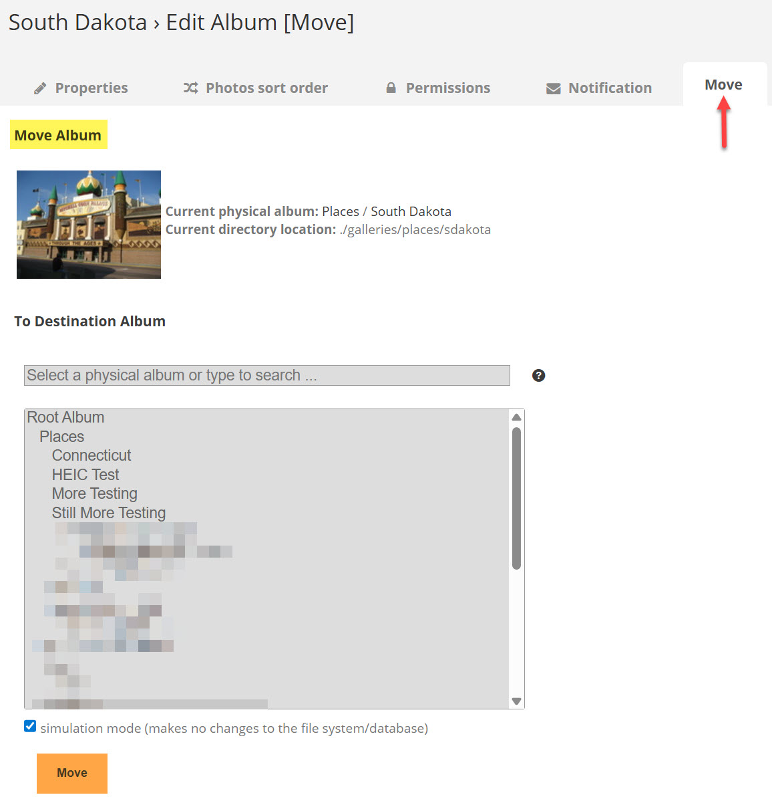
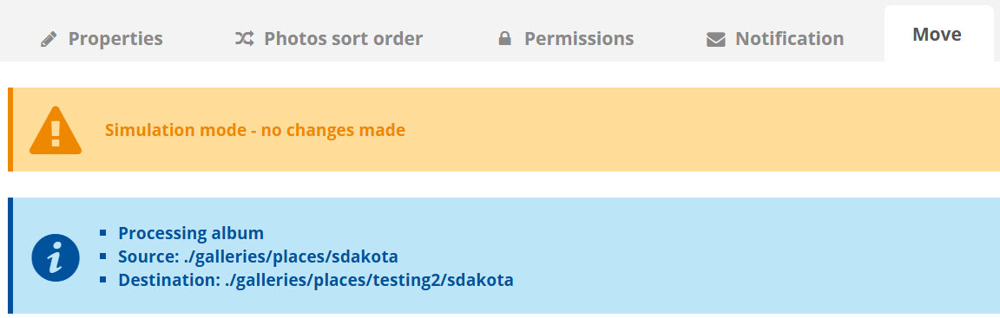
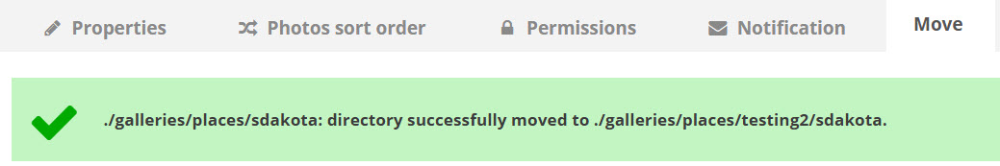
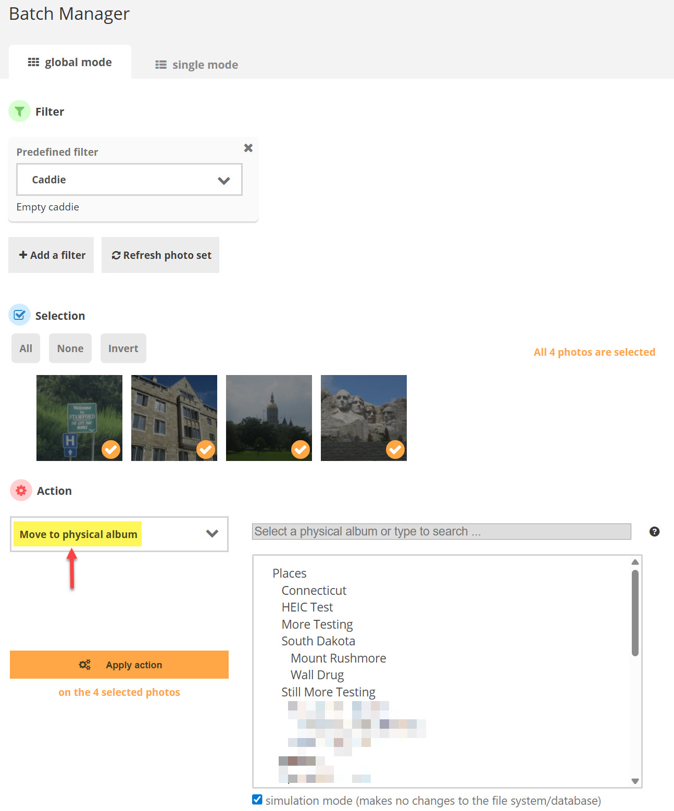
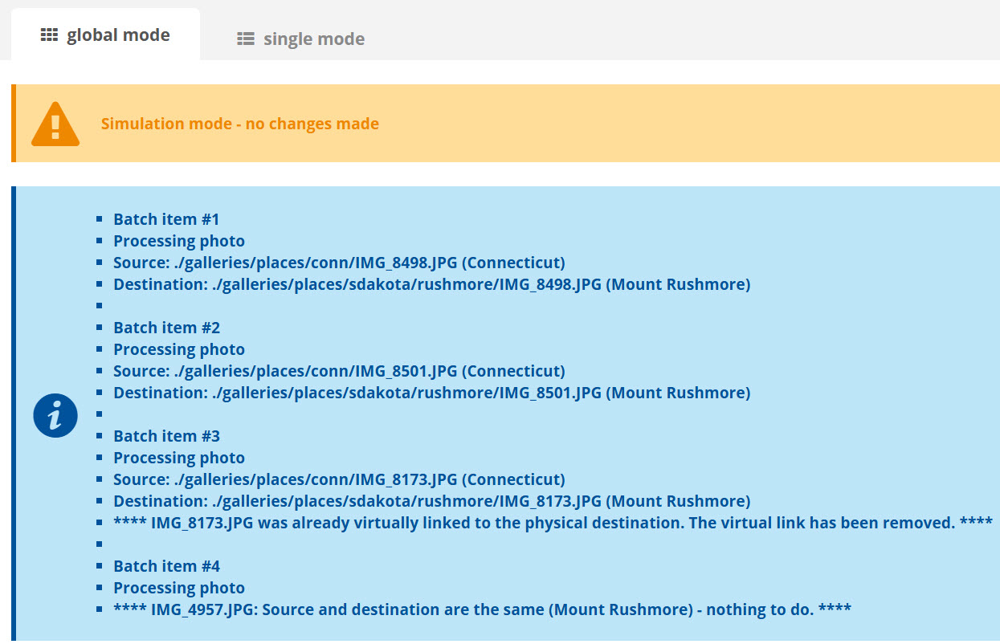

# Physical Photo Move
PPM is a [Piwigo](http://piwigo.org/) extension to move a photo, video, or album from one physical album to another, preserving all metadata.

I don't use the default [virtual albums](https://doc.piwigo.org/organizing-albums/albums-and-sub-albums-piwigo#block-216b1326eaf1475a97c7f1d9b29c1eef) structure as I prefer to have all of my photos stored in folders of my own hierarchical design rather than the one created by Piwigo's upload mechanism (i.e., `./upload/year/month/day/randomfilename.jpg`). The problem with using physical albums, however, is that I tend to occasionally re-organize and move a photo, video, or album into a different physical folder. Then the next time I run Piwigo's [synchronization process](https://doc.piwigo.org/self-hosting-piwigo/importing-and-synchronizing-ftp-photos#block-993d2aa78eb843afad365ed5709725d3) the file's original location is deleted from the database and re-added in the new folder location. This means all of the metadata associated with the item (tags, description, etc.) are lost and I have to enter them all again.

PPM (Physical Photo Move) is an attempt to alleviate this inconvenience by allowing an existing item in a physical folder (i.e., not in the upload folder and linked into a virtual album) to be moved to another physical folder and keep all the existing metadata.

- - -
## Usage

After activating the plugin for your Piwigo site, there will be a "Move" tab in the "Edit" area for any item that is located in a physical album.

### Moving a Photo (or Video)

Select a destination album (only other physical albums are shown).

Click "Move." With the simulation checkbox on, only informational messages are displayed (the item is not moved and the database is not updated). 

If everything in the source and destination looks good, turn off the simulation checkbox, select the destination album again, and click "Move" to move the item.

If an item with the same name already exists in the destination, the source file will be renamed before it is moved and an informational message will be displayed:

Only the stored album (i.e., the folder location on disk) is changed, along with the corresponding information in the database. Any virtual albums linked to the photo will be unchanged. This includes any physical albums that the photo is associated with "virtually" but not physically stored in (linked albums). If the photo is being moved to a physical album that it is already linked to (see issue [#3](https://github.com/jradwan/Piwigo-physical_photo_move/issues/3)), a message will be displayed indicating the virtual link has been removed:

All previously generated representatives (thumbnails for non-image files) and derivatives (resizes, thumbnails, etc. for images) are also moved to their proper destination directories.

### Moving an Album

Either select a destination album (only physical albums are shown and the current album and its sub-albums are hidden from the list, preventing you from moving a parent folder into itself or one its children) or turn on the "Move to root album" checkbox to move the album into your gallery's home album.

Click "Move." With the simulation checkbox on, only informational messages are displayed (the folder is not moved and the database is not updated). 

If everything in the source and destination looks good, turn off the simulation checkbox, select the destination album again, and click "Move" to move the album.

If a folder (directory) with the same name already exists in the destination (i.e., you selected the parent of the current album), the move will be aborted:

### Using Batch Manager

PPM also supports Piwigo's Batch Manager for moving multiple items at a time. In global mode, select the "Move to physical album" action to show the destination album list:

Follow the same instructions as above to batch move the items to the selected destination album. Multiple messages will be displayed showing the status of each file:

- - -
## Disclaimer

This is my first attempt at developing a plug-in for Piwigo! It was created to address a specific problem I was having with photo management and physical albums. 

***WARNING!*** PPM makes file system and database changes! _Please_ make sure you have a backup of your Piwigo folder structure and database before trying this plugin for the first time. 

No program is without bugs and while I've tested the plugin extensively myself, there's always the possibility for something to go wrong. Use simulation mode and check the debugging messages closely before allowing the plugin to make actual changes for the first time. If you find a problem, please open an issue [here](https://github.com/jradwan/Piwigo-physical_photo_move/issues) on Github or on the [Piwigo forums](http://piwigo.org/forum/) and let me know!

- - -
## Contact

Jeremy C. Radwan

- https://github.com/jradwan
- http://www.windracer.net/blog

- - -
## References

- [Piwigo](http://piwigo.org/)
- [Piwigo Extensions](http://piwigo.org/ext/)
- [Piwigo Plugin Development](https://github.com/Piwigo/Piwigo/wiki/Plugin-developpement)
- [Piwigo Plugin Tutorial](https://github.com/Piwigo/Piwigo/wiki/Plugin-Tutorial:-Hello-world!)
